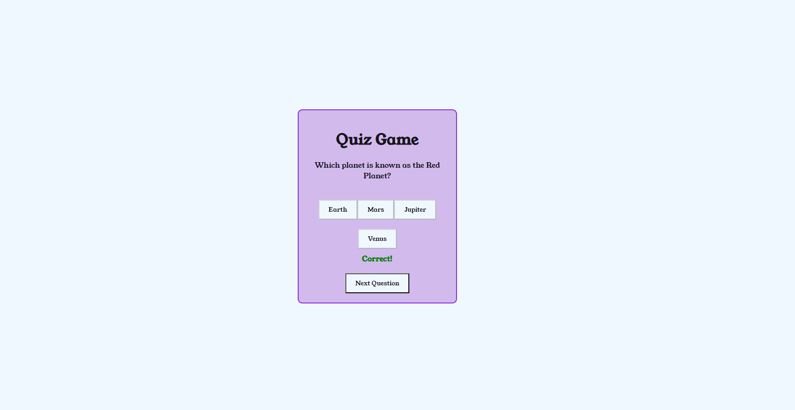

# Quiz Game (JavaScript Game)

QUIZ Game is a responsive website built for the sole purpose of completing the Second Milestone Project for the Code Institute's Full Stack Developer course. It was built using the knowledge gained from the HTML, CSS and JavaScript modules.

The live website can be viewed here [QUIZ GAME](https://bogdanmaria.github.io/Quiz-pp2/).

.

# UX Design

## User stories

### As a **first time user*
- I want to understand easily the purpose of the website and how to use it.
- I want to be able to play the game easily.
- I want to be able to navigate easily.
- I want to be amused.

### As a **returning** and a **frequent user**
- I want to have different questions without repetitions.
- I want to play multiple games.

### All users want to be able to access and comfortably view the website on mobile devices

## Design
### Typography
[Young Serif](https://fonts.google.com/specimen/Young+Serif?query=young) was chosen due to it being neutral, soft and easy to read even on smaller screens.
### Colour Scheme

#### 16151C
Has been used to display the Questions and answers.
#### F0F8FF
Has been used for background.
#### D2BAED
Has been used for quiz container background.
#### 8A2BE2
Has been used for the border of the quiz container.

### Wireframes
#### Home

#### Questions and answers

#### Your Score and name

## Features
### Main Page
On main page you have to input your name and can select to play.

### Play Page
On the play page you have the question of the game and the multiple answers.

### Feedback 
After selecting an answer you get the feedback if it is correct or incorrect and you have a button to display the next question.

### Name and score
On the last page you have your score displayed and the button to restart the quiz.

You are not able to start the game without inputing a name. After selecting an answer you get the feedback if it is wright or wrong and you are not able to select another answer. After selecting next question button the next question will be displayed. At the end you have your score displayed.

# Technologies
- HTML to accomplish the structure of the website.
- CSS to style the website.
- [gitpod](https://gitpod.io/) IDE to develop the website.
- [GitHub](https://GitHub.com/) to host the source code and GitHub Pages to deploy and host the live site.
- Git to provide version control (to commit and push code to the repository).
- [Google Fonts](https://fonts.google.com/) for typography.
- [Google Chrome Dev Tools](https://developers.google.com/web/tools/chrome-devtools) for debugging, inspecting pages' elements and testing layout.
- [Favicon.cc](https://www.favicon.cc/) to create the website favicon.
- [Color](https://coolors.co/image-picker) to source colour palette.
- [Balsamiq](https://balsamiq.com/wireframes/) to design wireframes.
- [Amiresponsive](https://ui.dev/amiresponsive) to create the Mockup image in this README.
- Google Chrome's [Lighthouse](https://developers.google.com/web/tools/lighthouse) to assess accessibility.
- [W3C HTML Markup Validator](https://validator.w3.org/) to validate HTML code.
- [W3C Jigsaw CSS Validator](https://jigsaw.w3.org/css-validator/) to validate CSS code.
- [Chat GPT](https://chat.openai.com/auth/login) to generate the questions for the quiz.
- Code Institute's Gitpod Template to generate the workspace for the project.